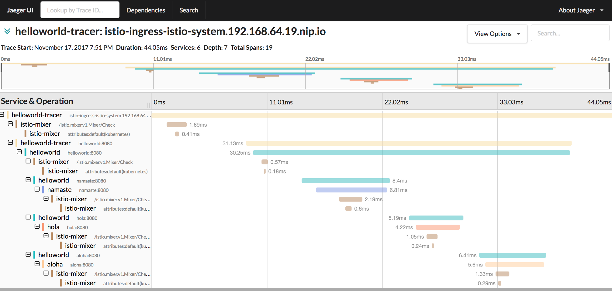
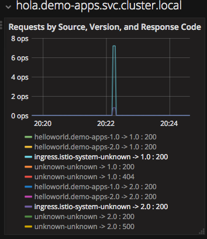
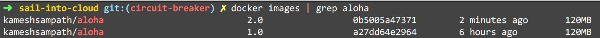
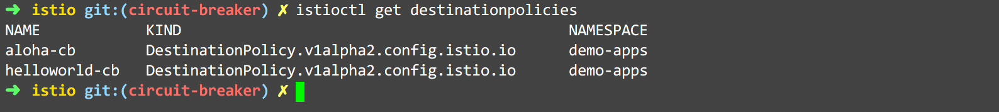

:linkattrs:

= Sail into Cloud

The repository holds the application sources that are used to demonstrate the following features of https://istio.io/[Istio],

* https://istio.io/docs/tasks/zipkin-tracing.html[Distributed tracing]
* https://istio.io/docs/reference/config/traffic-rules/routing-rules.html[Canary Releases]
* https://istio.io/docs/reference/config/traffic-rules/destination-policies.html#istio.proxy.v1.config.CircuitBreaker[Circuit Breakers]

[[pre-req]]
== Prerequisite

Istio requires any running Kubernetes cluster. 

https://github.com/minishift/minishift[minishift] - v1.8.x with OpenShift version v3.7.0-rc.0 or above

(OR)

https://kubernetes.io/docs/getting-started-guides/minikube/[minikube] v0.23.0

[[istio-setup]]
== Istio Quicksetup

Download https://github.com/istio/istio/releases/latest[istio] and extract the same to the local machine, this location will be referred to as $ISTIO_HOME,
add $ISITO_HOME/bin to the *PATH*

NOTE: as of this demo `0.2.12` was the latest version

=== Core 
[code,sh]
----
oc new-project istio-system <1>

oc adm policy add-scc-to-user anyuid -z istio-ingress-service-account -n istio-system <2>
oc adm policy add-scc-to-user anyuid -z istio-egress-service-account -n istio-system <3>
oc adm policy add-scc-to-user anyuid -z default -n istio-system <4>

oc apply -f $ISTIO_HOME/install/kubernetes/istio.yaml <5>

oc expose svc istio-ingress <6>
----

<1> - create a new openshift project to hold istio core components
<2> - allows istio-ingress-service-account to run the pods with UID `0`
<3> - allows istio-egress-service-account to run the pods with UID `0`
<4> - allows default to run the pods with UID `0`
<5> - install core Istio components
<6> - Expose the istio-ingress service

=== Addons 

[code,sh]
----
oc apply -f install/kubernetes/addons/prometheus.yaml <1>
oc apply -f install/kubernetes/addons/grafana.yaml <2>
oc apply -f install/kubernetes/addons/servicegraph.yaml <3>

oc expose svc servicegraph <4>
oc expose svc grafana <5>

oc process -f https://raw.githubusercontent.com/jaegertracing/jaeger-openshift/master/all-in-one/jaeger-all-in-one-template.yml | oc create -f - <6>
----

<1> - Install Prometheus to gather metrics from the services
<2> - Grafana will be used as monitoring dashboard 
<3> - servicegraph is used to visualize service dependencies
<4> - expose servicegraph service
<5> - expose grafana service
<6> - Deploy Jaeger to collect the spans and traces

Successful setup will have the following pods and services running,

[NOTE]
====
* This demo we will not use *istio-auth*
* https://grafana.com/[Grafana] is used to display the Istio Dashboard
* https://uber.github.io/jaeger/[Jaeger] is used to collect spans and traces (Distributed Tracing) from the application
* https://prometheus.io/[Prometheus] is used for monitoring
* servicegraph is a visual representation of service and its interactions
====

==== Accessing Addons

All the applications can be accessed using the minishift command `minishift openshift service`

[code,sh]
----
minishift openshift service grafana -n istio-system 
minishift openshift service jaeger-query -n istio-system 
minishift openshift service servicegraph -n istio-system 
----

NOTE: if you have deployed isito in different namespace than `istio-system`, alter the `-n` parameter accordingly

[TIP]
====
 * To open the service url in browser, add the option `--in-browser` `minishift openshift service` e.g. `minishift openshift service grafana -n istio-system --in-browser`
 * To just know the url of the service do `minishift openshift service grafana -n istio-system  --url`
====

Detailed instructions for other platforms is available at https://istio.io/docs/setup/kubernetes/quick-start.html

[[building]]
== Building

Clone the sources from https://github.com/workspace7/sail-into-cloud, the location of clone will be called $PROJECT_HOME.

The repositories has 4 branches namely:

* *sidecar* - the sources used to demo http://blog.kubernetes.io/2015/06/the-distributed-system-toolkit-patterns.html[sidecar]
* *tracing* - the sources used to demo https://istio.io/docs/tasks/telemetry/distributed-tracing.html[distributed tracing]
* *canary* - the sources used to demo canary releases
* *circuit-breaker* - the sources used to demo https://martinfowler.com/bliki/CircuitBreaker.html[circuit breaker]

The application that wil be used in the demo is a simple Hello World spring boot application that says hello in different languages. The sources are available
in the repo under link:./apps[Apps].

We will create a new project called "demo-apps" where we will deploy all the demo applications. To create the new project run the command 
`oc new-project demo-apps`

Since some of the demo applications needs privileged user permissions, we need to add the required permissions to the default service account,

[code,sh]
----
oc adm policy add-scc-to-user anyuid -z default -n demo-apps
----

== Apply Ingress rules

Each application will not expose its service to the outside world, all service requests will be routed via `istio-ingress`.  The following
commands will create a ingress routes to all the applications that will be used in the demo except for hello-sidecar.

[code,sh]
----
cd $PROJECT_HOME
oc apply -f helloworld_ingress.yaml
----

[[sidecar]]
== Sidecar

[code,sh]
----
cd $PROJECT_HOME/1_sidecar/hello-sidecar
git checkout sidecar
oc apply -f hello-sidecar.yaml <1>
oc expose svc hello-sidecar <2>
----
<1> Deploys a apache httpd server, the static web resources of httpd server will be enriched via sidecar which is a small git synchronizer, that pulls
the static sources from the github repo https://github.com/kameshsampath/hello-sidecar
<2> Expose the service to be accessible outside

=== Accessing Application

To get the application url run the following command,

[code,sh]
----
minishift openshift service hello-sidecar --namespace demo-apps <1>
----

<1> this outputs the application url, if you wish to open the same in the browser add the flag `--in-browser`,

[code,sh]
----
minishift openshift service hello-sidecar --in-browser --namespace demo-apps
----

[[distributed-tracing]]
== Distributed Tracing

This demo shows how to do distributed tracing with https://istio.io[Istio], this steps requires <<istio-setup>> is done and all pods are up and running.

=== Building the application
[code,sh]
----
eval $(minishift docker-env) <1>
cd $PROJECT_HOME/apps
git checkout tracing <2>
./mvnw clean install
----

<1> setup the DOCKER_HOST and other environment variables that will be required to build and push the DOCKER images
<2> Checkout out the `tracing` tag

Successful build will show the following version *1.0* of the application docker images,

=== Deploying the application

The application can be deployed to Istio service mesh using the following commands,

[code,sh]
----
cd $PROJECT_HOME/2_tracing/istio
oc apply -f <(istioctl kube-inject -f $PROJECT_HOME/2_tracing/istio/helloworld.yaml) <1>
oc apply -f itsio_helloworld.yaml <2>
----

<1> Add the Istio service mesh related https://kubernetes.io/docs/concepts/workloads/pods/init-containers/[init-containers] and sidecar proxy
<2> Deploy the apps for tracing

Successful deployment will show the following pods running,

== Accessing the application

To access the application we can use the `minishift openshift service` command, 

[code,sh]
----
curl $(minishift openshift service istio-ingress -n istio-system --url)/hellotracer
----

=== Jaeger Tracing

==== Traces and Span

Access the Jaeger `minishift openshift service jaeger-query -n istio-system --in-browser` to see the traces

==== Service Dependencies

Switching to "Dependencies" tab of the Jaeger UI will show the service dependency graph

[[canary-release]]
== Canary Release

In this we will deploy a new version of the "hola" application and add some routing rules to enable https://martinfowler.com/bliki/CanaryRelease.html[Canary Release]
that distributes the load between two versions of the applications using https://istio.io/docs/tasks/request-routing.html[Istio Routing Rules]

=== Building the application
[code,sh]
----
eval $(minishift docker-env) <1>
git checkout canary <2>
cd $PROJECT_HOME/apps/hola
./mvnw clean install
----

<1> setup the DOCKER_HOST and other environment variables that will be required to build and push the DOCKER images, if you have already done this, no need to repeat but its required whenever a new shell is opened
<2> Checkout out the `canary` tag

Successful build will show the following version *2.0* of the hola application docker image,

image::./app_hola_images_v2.png[Hola Application Docker Image v2.0]

=== Deploying the application

The application can be deployed to Istio service mesh using the following commands,

[code,sh]
----
cd $PROJECT_HOME/3_canary/istio
oc apply -f <(istioctl kube-inject -f $PROJECT_HOME/3_canary/istio/hola-v2.yaml)
----

Successful deployment will show the following pods running,

=== Creating Routing route rules

The following command creates the two Istio routing rules,

* that distributes the application traffic in the ratio of 1:4 between v1.0 and v2.0 of the hola application
* routes all traffic to v2.0 of hola application if the request has the header *cust-type=premium*

[code,sh]
----
cd $PROJECT_HOME/3_canary/istio
istioctl create -f hola-rules-all.yaml
----

Successful rules creation should show the  list of rules as shown below,

=== Accessing the application

If you run a load test with any load test tools like jmeter, gatling etc., to the url `$(minishift openshift service istio-ingress --namespace istio-system --url)/hola` to see the routing rules getting applied.

This demo uses gatling and thats configured as part of hola v2.0 app

==== Traffic without headers

[code,sh]
----
cd $PROJECT_HOME/apps/hola
git checkout canary
./mvnw -Dskip.gatlingTests=false -Dgatling.simulationClass=HolaServiceSimulation -Dhola.it.endpoint.url=$(minishift openshift service istio-ingress --namespace istio-system --url) clean integration-test
----

==== Traffic with header cust-type=premium

[code,sh]
----
./mvnw -Dskip.gatlingTests=false -Dgatling.simulationClass=HolaCanaryPremiumSimulation -Dhola.it.endpoint.url=$(minishift openshift service istio-ingress --namespace istio-system --url) clean integration-test
----

[[circuit-breakers]]
== Circuit Breakers

In this we will deploy a new version of the "aloha" application and add some routing rules to enable https://martinfowler.com/bliki/CircuitBreaker.html[Circuit Breakers]
that distributes the load between two versions of the applications using https://istio.io/docs/tasks/request-routing.html[Istio Routing Rules]

=== Building the application
[code,sh]
----
eval $(minikube docker-env) <1>
git checkout circuit-breaker <2>
cd $PROJECT_HOME/apps/aloha
./mvnw clean install
cd $PROJECT_HOME/apps/helloworld
mvn clean install
----

1> setup the DOCKER_HOST and other environment variables that will be required to build and push the DOCKER images, if you have already done this, no need to repeat but its required whenever a new shell is opened
<2> Checkout out the `circuit-breaker` tag

Successful build will show the following version *2.0* of the hola application docker image,

=== Deploying the application

The application can be deployed to Istio service mesh using the following commands,

[code,sh]
----
cd $PROJECT_HOME/4_circuit_breaker/istio
oc apply -f <(istioctl kube-inject -f $PROJECT_HOME/4_circuit_breaker/istio/circuit-breaker.yaml)
----

Successful deployment will show the following pods running,

=== Creating Destination policies

Running the following command will create the destination policy to aloha that will apply the circuit breakers,

[code,sh]
----
cd $PROJECT_HOME/4_circuit_breaker/istio
istioctl create -f aloha-cb-policy.yaml
----

Successful creation of Circuit Breakers above will show like,

=== Checking Circuit Breakers

Run the following command,

[code,sh]
----
./mvnw -Dskip.gatlingTests=false -Dhelloworld.it.endpoint.url=$(minishift openshift service istio-ingress --namespace istio-system --url) clean integration-test
----

--END--